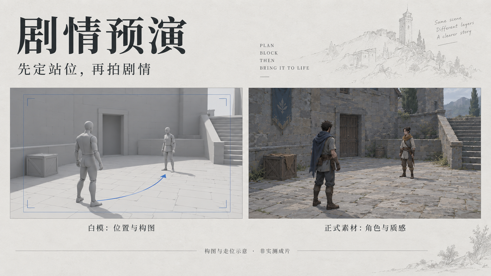

# 剧情预演 · Plot Previs

先把角色站在哪、朝哪看、镜头怎么走弄清楚，再做正式视频。



> 封面为 AI 辅助制作的游戏场景概念示意，不是工具运行截图，也不是实际生成效果对比。

## 这是做什么的？

「剧情预演」是一份给 AI 助手使用的 Skill，适合游戏剧情短片、角色互动、过场动画和连续跟拍镜头。它先用简单白模验证空间与镜头，再把确认后的白模关键帧或预演视频交给后续制作，作为**位置与构图参考**。

它不是一键生成视频的软件，也不自带三维引擎或视频模型。可以结合 Blender、现有三维预演工具以及 Seedance 等视频生成工具使用，不绑定专属平台。

## 解决哪些问题？

- 两个人本该面对面，却看向镜头或同一方向。
- 角色走到对面后，下一个镜头又突然回到原位。
- 桌子、门、楼梯的位置变了，动作接不上。
- 镜头绕行时穿墙、越轴，或错过了抓取、落地等关键动作。
- 正式画面漂亮，但观众看不懂谁在做什么、为什么这样做。

## 白模和正式素材怎么分工？

| 参考材料 | 负责什么 |
| --- | --- |
| 白模关键帧 / 连续预演 | 角色与道具的位置、相对尺度、朝向、遮挡、构图和相机路径 |
| 正式角色 / 宠物素材 | 面孔、服装、外形与识别特征 |
| 确认后的首帧 | 与白模一致的开局，以及最终视觉风格 |
| 关键动作状态图 | 动作的起始、执行过程与可见结果 |

**继承白模的空间关系，不继承白模的灰色材质和木偶动作。** 参考相互矛盾时先修正，不靠堆提示词掩盖问题。

## 一个游戏剧情例子

玩家从庭院左侧走向守卫，停在木箱旁，与右侧守卫对视；镜头沿玩家侧后方跟随，最后让门口和两名角色同时进入画面。

预演时先检查：路线是否畅通、停下时双方朝向是否正确、木箱会不会挡脸，以及镜头是否能交代门的位置。空间确认后，再用正式角色与场景素材制作画面。封面只示意这一类空间关系，不代表已经完成该片段。

## 怎样使用？

1. 下载下方 ZIP，解压出 `plot-previs` 文件夹。
2. 将文件夹放入支持 Skill 的 AI 助手所使用的技能目录，按该工具要求刷新或重新加载。
3. 提供剧情、画幅、角色素材和镜头限制，再调用 `$plot-previs`。

[下载技能包](%E5%89%A7%E6%83%85%E9%A2%84%E6%BC%94-%E5%85%AC%E5%BC%80%E7%89%88-v2.zip) · [阅读完整技能](SKILL.md)

可直接这样开始：

```text
使用 $plot-previs，为这段游戏剧情做白模预演。
画幅 9:16，两名角色先面对面，随后其中一人绕过桌子走到另一侧。
尽量少切镜头，检查朝向、遮挡、接触和穿模。
白模只作为位置、构图和运镜参考，人物外形使用我提供的正式素材。
先展示预演和关键帧，确认后再准备视频生成方案。
```

## 会交付什么？

按剧情需要提供空间布局、白模关键帧或可播放预演、已制作的源工程、素材参考清单，以及 `PASS / FAIL / UNVERIFIED` 分项检查结果。只有静帧时，不把连续动作标为已验证；能解码播放，也不等于视觉验收通过。

本方法用于减少空间和构图歧义，不保证模型逐帧复现。付费生成、重试和发布仍需单独授权。此仓库提供技能说明和下载包，不包含视频平台账号、API 密钥或原项目素材。
